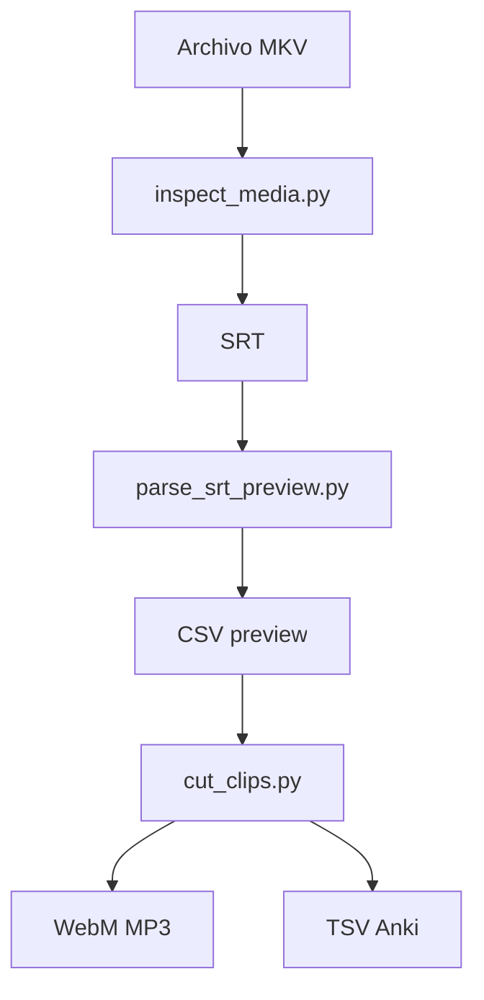
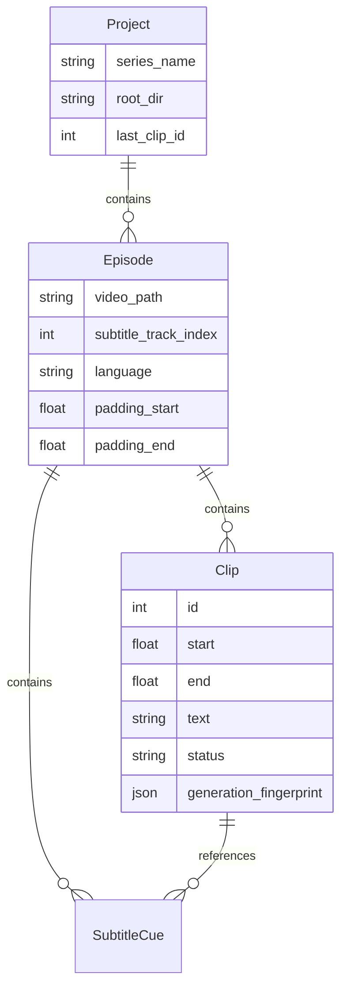

# Arquitectura actual y objetivo

## Arquitectura actual (pre-refactor completo)

```text
Entry points (raíz)
├── parse_srt_preview.py  ──► core/subtitle_parser.py
├── cut_clips.py          ──► core/clip_engine.py
├── inspect_media.py      ──► ffprobe/ffmpeg directo
└── gui_app.py            ──► core/* + mpv (monolítico)

core/
├── subtitle_parser.py    # SRT → oraciones → CSV
└── clip_engine.py        # CSV → clips → TSV + DeepL
```

La separación CLI/core ya existe parcialmente. La GUI reutiliza funciones de
`core/` pero mantiene estado ad hoc en listas de dicts.

## Flujo de datos CLI



## Formato CSV preview

Cabecera: `line_number,start,end,duration_sec,text`

- Timestamps: `HH:MM:SS.mmm`
- `line_number` no afecta numeración de clips (usa orden de filas)

## Formato TSV Anki (9 campos, sin cabecera)

```text
id \t episode \t episode_title \t video \t video_reference \t video_audio \t english_dialogs \t spanish_dialogues \t notes
```

**No modificar** este esquema sin acuerdo explícito.

## Padding

`compute_padded_windows()` expande start/end sin invadir tiempos de líneas
vecinas (usa tiempos originales del CSV, no padded).

## Corte FFmpeg

- **Batch:** un proceso, filter graph `split/asplit + trim/atrim`
- **Individual (GUI):** seek grueso + trim fino (`cut_single_clip`)

## Arquitectura objetivo (evolutiva)

```text
anki_video_tool/
├── core/           # Lógica compartida + naming
├── media/          # ffprobe, extracción (desde inspect_media)
├── persistence/    # Project/Episode/Clip JSON
├── translation/    # Providers (fase 13)
├── export/         # TSV (fase 14)
├── ui/             # Widgets PySide6 (fases 4–9)
├── docs/
└── [CLI scripts]   # Compatibles
```

## Modelo de datos objetivo (Fase 2+)



## Estados de clip (objetivo)

| Estado | Significado |
|--------|-------------|
| PENDING | Sin generar |
| MODIFIED | Tiempos/texto cambiados tras generación |
| PREVIEW | Previsualizado, no exportado |
| GENERATED | Archivos válidos en disco |
| OUTDATED | Config cambió respecto a generación |
| ERROR | Falló el procesamiento |

## Principios de diseño

1. CSV/TSV como I/O, no como fuente de verdad interna.
2. Un motor FFmpeg compartido CLI/GUI.
3. Regeneración basada en fingerprint, no solo `os.path.exists()`.
4. Cambios por fases pequeñas y testeables.

## Mapa de fases

| Fase | Objetivo |
|------|----------|
| 0 | Análisis (este documento) |
| 1 | Estabilizar: docs, requirements, media/probe, naming, fixes GUI |
| 2 | Modelo Project/Episode/Clip + JSON |
| 3 | FFprobe en GUI |
| 4 | Subtítulos en GUI con opciones parser |
| 5 | Reproducción mpv mejorada |
| 6 | Edición Start/End + undo |
| 7 | Preview vs generar |
| 8 | Unir subtítulos con trazabilidad |
| 9 | Guardar/recuperar proyecto |
| 10 | Generar clip individual (naming CLI) |
| 11 | Detección OUTDATED |
| 12 | Batch limitado + cancelación |
| 13 | TranslationProvider |
| 14 | TSV solo clips GENERATED |
| 15 | Numeración global persistida |
| 16 | Errores amigables + logs |
| 17 | Tests + documentación final |
