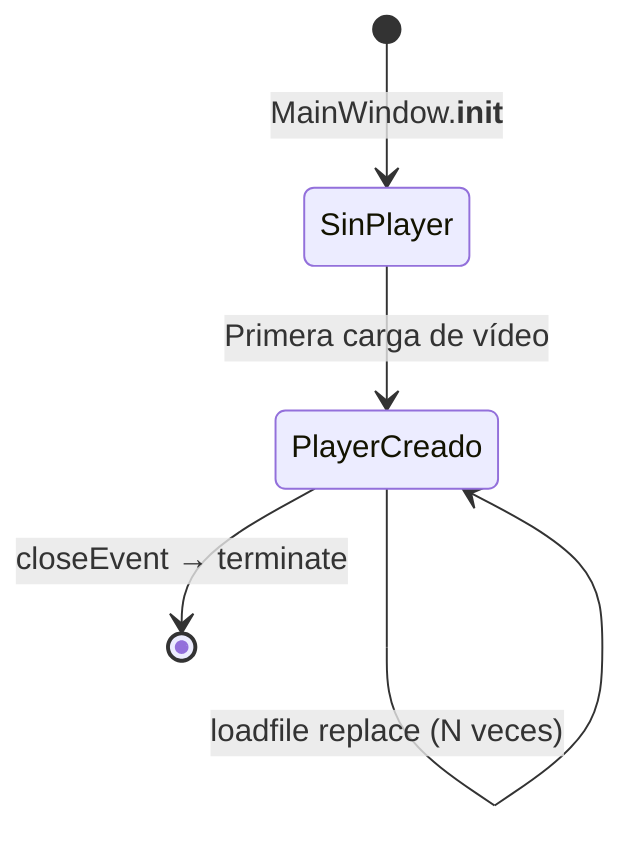
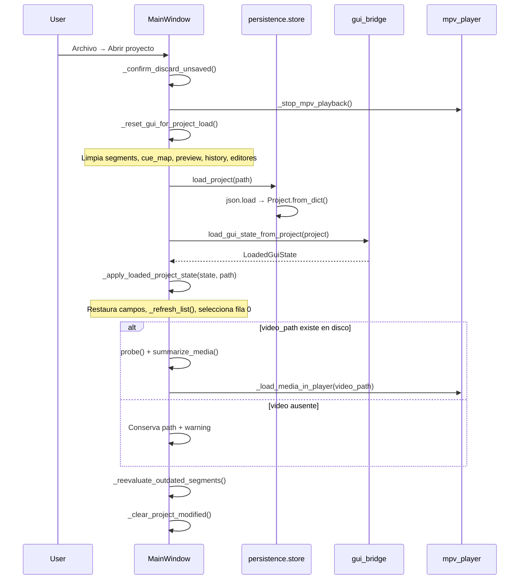
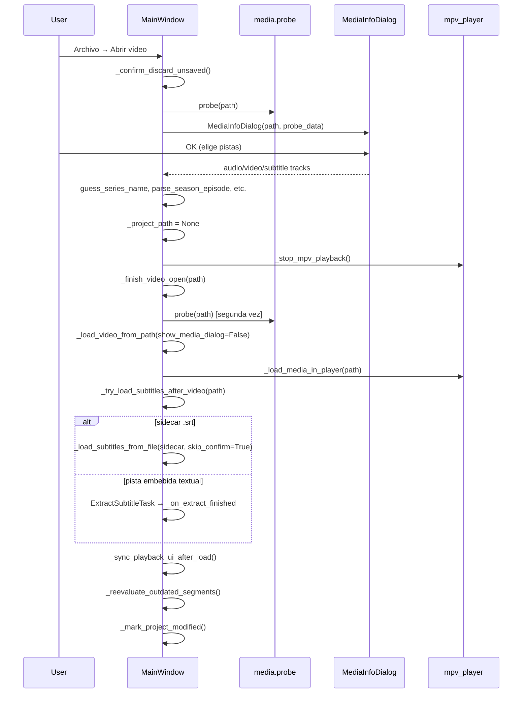

# Arquitectura — Anki Video Tool

Documento de referencia del estado **actual** de la aplicación GUI (`gui_app.py`). Describe el ciclo de vida de mpv, los modelos de datos en memoria, la persistencia JSON y los flujos de carga e interfaz. **No propone correcciones**; solo documenta el comportamiento existente.

---

## Índice

1. [Ciclo de vida de `mpv.MPV()`](#1-ciclo-de-vida-de-mpvmpv)
2. [Eventos mpv ↔ Qt](#2-eventos-mpv--qt)
3. [Clips y bloques SRT en memoria](#3-clips-y-bloques-srt-en-memoria)
4. [Archivo `.anki-project.json`](#4-archivo-anki-projectjson)
5. [Flujos de carga](#5-flujos-de-carga)
6. [Controles de la interfaz](#6-controles-de-la-interfaz)
7. [Menú Archivo y Edición](#7-menú-archivo-y-edición)
8. [Notas y edge cases](#8-notas-y-edge-cases)

---

## 1. Ciclo de vida de `mpv.MPV()`

### 1.1 Arranque de la aplicación

Antes de crear `QApplication`, el proceso configura el entorno para mpv:

| Paso | Función | Archivo |
|------|---------|---------|
| Variables PipeWire/Pulse | `configure_mpv_environment()` | `ui/mpv_embed.py` |
| Plataforma Qt (`xcb` en Wayland+XWayland) | `_configure_qt_platform_for_mpv()` | `gui_app.py` |
| Locale numérico `C` (requerido por libmpv) | `_ensure_mpv_numeric_locale()` | `gui_app.py` |

Tras `QApplication(sys.argv)`, se crea `MainWindow`, que construye la UI en `_build_ui()`. **En este momento aún no existe ningún `mpv.MPV`.**

### 1.2 Dos capas de embed (mutuamente excluyentes)

La elección se hace **una sola vez** al construir la UI (`gui_app.py`, `_build_ui()` ~L955), según `_should_use_opengl_embed()`:

| Capa | Condición | Widget vídeo | Creación de `mpv.MPV` |
|------|-----------|--------------|------------------------|
| **Capa 1 — wid** | X11 / XWayland con `DISPLAY`, o `ANKI_FORCE_MPV_WID=1` | `QFrame` con `WA_NativeWindow` | Lazy: `_ensure_mpv_player()` al cargar el primer vídeo |
| **Capa 2 — OpenGL** | Wayland nativo sin XWayland, o `ANKI_FORCE_MPV_GL=1` | `MpvGlWidget` (`QOpenGLWidget`) | Lazy: `MpvGlWidget.initializeGL()` |

Opciones comunes de ambas capas (`ui/mpv_embed.py`, `mpv_player_kwargs()`):

- `keep_open=True`, `idle=True` — el player permanece vivo sin archivo
- `osc=False`, teclado mpv desactivado
- `hwdec=auto-safe`, `ao=pulse,pipewire,alsa`

Capa 1 además pasa `wid=str(winId())` y `vo=x11` (o `gpu,x11` según plataforma).

### 1.3 Creación (lazy, una instancia por sesión)



**Capa 1 (`wid`):**

1. `_load_video_from_path()` o `_apply_loaded_project_state()` llama a `_load_media_in_player(path)`.
2. Si `self.player is None`, `_ensure_mpv_player()`:
   - Garantiza ventana nativa del `QFrame` (`_ensure_native_video_window()`).
   - Fuerza `LC_NUMERIC=C`.
   - Instancia `mpv.MPV(log_handler=_mpv_log, wid=..., vo=...)`.
3. Si el `QFrame` aún no tiene ventana nativa, la carga se difiere con `QTimer.singleShot(0, _deferred_load_media_in_player)`.

**Capa 2 (OpenGL):**

1. `MpvGlWidget` se crea en `_build_ui()` pero **sin** player.
2. En `initializeGL()` se crean `mpv.MPV(vo="libmpv")` y `MpvRenderContext` OpenGL.
3. `MainWindow.player` se sincroniza con `_mpv_gl_widget.player` vía `_sync_gl_player_ref()` (polling con `QTimer`).

### 1.4 Recarga de vídeo (sin destruir el player)

Desde la Fase 12.3, **abrir otro vídeo o cargar un proyecto no llama a `terminate()`**. El flujo es:

1. `_stop_mpv_playback()` — pausa, `command("stop")`, desactiva A-B loop.
2. `_load_media_in_player(path)`:
   - Capa 1: `player.command("loadfile", path, "replace")` vía `_mpv_loadfile()`.
   - Capa 2: `MpvGlWidget.load(path)` → mismo comando `loadfile replace`.
3. Tras 300 ms: `_pause_mpv_after_load()` (pausa automática).
4. Tras 500 ms: `_verify_mpv_playback()` (comprueba que `player.path` esté poblado).

### 1.5 Destrucción (solo al cerrar la ventana)

`closeEvent()` → `_prompt_save_before_close()` → `_shutdown_mpv_player()`:

**Capa 2:** delega en `MpvGlWidget.shutdown()`:
- `render_ctx.free()` → `player.pause = True` → `player.terminate()`.

**Capa 1:**
1. Detiene timer de posición y A-B loop.
2. `player.pause = True`, `command("stop")`, `ab_loop_a/b = "no"`.
3. **`player.wid = "0"`** — desvincula el wid del `QFrame` X11.
4. `QApplication.processEvents()`.
5. `player.terminate()`.
6. `self.player = None`.

No hay handler `aboutToQuit` ni destructor de widget como respaldo.

### 1.6 Hilos de ejecución

| Componente | Hilo | Notas |
|------------|------|-------|
| Toda la GUI PySide6 | **Hilo principal Qt** | Slots de botones, spinboxes, timers, `closeEvent` |
| Comandos mpv desde Python | **Hilo principal Qt** | `player.command(...)`, asignación de propiedades |
| Event loop interno de libmpv | **Hilo interno de python-mpv** | No expuesto directamente a la GUI |
| `log_handler` (`_mpv_log`) | Posiblemente hilo mpv | Solo imprime a stderr; no toca widgets |
| `MpvRenderContext.update_cb` | Posiblemente hilo mpv | Asignado a `self.update` del widget OpenGL — único callback mpv→Qt |
| Posición de reproducción | **Hilo principal Qt** | Polling de `player.time_pos` cada 200 ms (`QTimer` → `_update_position_label`) |
| Corte FFmpeg / batch / extracción SRT | **QThreadPool** | `CutTask`, `BatchGenerateTask`, `ExtractSubtitleTask` — independiente de mpv |

**No se usan** `@property_observer`, `observe_property()` ni callbacks de eventos mpv (`file-loaded`, `end-file`, etc.).

---

## 2. Eventos mpv ↔ Qt

### 2.1 Dirección Qt → mpv

Toda interacción con mpv se inicia desde el hilo Qt, conectada por señales estándar de widgets:

| Origen UI | Señal | Método destino | Efecto en mpv |
|-----------|-------|----------------|---------------|
| `preview_btn` | `clicked` | `preview_selected_clip()` | `_enable_segment_loop()` → seek, `ab_loop_a/b`, unpause |
| `play_btn` | `clicked` | `toggle_play_pause()` | `player.pause` o reinicia preview |
| `stop_btn` | `clicked` | `stop_preview()` | pause, `ab_loop_a/b = "no"` |
| `goto_start` / `goto_end` | `clicked` | `seek_to_segment_start/end()` | `command("seek", ...)` |
| `seek_back` / `seek_fwd` | `clicked` | `seek_relative(±1.0)` | `command("seek", ...)` |
| `start_spin` / `end_spin` | `valueChanged` | `_on_segment_bounds_changed()` | Actualiza A-B loop si preview activo |
| Carga de vídeo | (interno) | `_load_media_in_player()` | `command("loadfile", path, "replace")` |
| Cierre app | `closeEvent` | `_shutdown_mpv_player()` | stop, wid=0, terminate |

Atajos de teclado (`keyPressEvent`): Espacio → `toggle_play_pause`; ←/→ → `seek_relative`.

### 2.2 Dirección mpv → Qt

| Mecanismo | Qué actualiza | Métodos GUI invocados |
|-----------|---------------|----------------------|
| Polling `player.time_pos` (timer 200 ms) | `position_label` | `_update_position_label()` |
| `QTimer.singleShot` post-carga | Pausa y verificación | `_pause_mpv_after_load()`, `_verify_mpv_playback()` |
| `update_cb` (solo Capa 2) | Repintado OpenGL | `QOpenGLWidget.update()` → `paintGL()` — **no** llama métodos de negocio |
| `log_handler` | Consola stderr | Ninguno |

### 2.3 Qué NO se invoca desde callbacks mpv

Los siguientes métodos **solo** se ejecutan desde acciones de usuario, timers Qt en hilo principal, o workers FFmpeg (vía señales Qt queued):

- `_refresh_list()` — refresco de la lista de clips
- `_mark_segment_previewed()` — llamado desde `preview_selected_clip()` tras `_enable_segment_loop()`
- `on_segment_selected()` — cambio de fila en la lista
- `_on_cut_finished()` / `_on_batch_finished()` — respuesta a tareas FFmpeg

No hay cadena mpv-event → `_refresh_list` ni mpv-event → preview automático.

### 2.4 Workers en background (no mpv)

Clases con `Signal` en `gui_app.py`:

| Worker | Señal | Slot GUI |
|--------|-------|----------|
| `CutTask` | `finished` | `_on_cut_finished()` |
| `BatchGenerateTask` | `progress`, `finished` | `_on_batch_progress()`, `_on_batch_finished()` |
| `ExtractSubtitleTask` | `finished` | `_on_extract_finished()` |

Las señales Qt entre threads usan conexión queued por defecto; los slots se ejecutan en el hilo principal.

---

## 3. Clips y bloques SRT en memoria

### 3.1 Tres capas de representación

```text
Archivo .srt
    │
    ├─ parse_srt_blocks()  ──► bloques raw: {start, end, raw_text}
    │
    ├─ group_into_sentences() ──► oraciones agrupadas (carga inicial)
    │
    └─ cue_map[int]  ──► índice → {index, start, end, text}
                              text = raw_text sin normalizar (MAYÚSCULAS, HTML)

segment dict (clip de trabajo en GUI)
    └── referencia cue_map vía cue_indices[]
```

### 3.2 `cue_map` — bloques SRT individuales

Almacenado en `MainWindow.cue_map: dict[int, dict]`.

| Campo | Tipo | Origen |
|-------|------|--------|
| `index` | `int` | Índice 0-based del bloque SRT |
| `start` | `float` | Segundos (con offset/scale del parser) |
| `end` | `float` | Segundos |
| `text` | `str` | `raw_text` del SRT (sin `normalize_case`) |

Se construye en `_load_subtitles_from_file()` con una segunda pasada de `parse_srt_blocks()`, o se restaura desde el JSON del proyecto.

### 3.3 `segments` — clips de trabajo

Almacenado en `MainWindow.segments: list[dict]`. Cada segmento es un dict mutable.

**Campos base (siempre presentes tras carga):**

| Campo | Tipo | Descripción |
|-------|------|-------------|
| `id` | `int` | Identificador estable del clip (usado en nombres de archivo) |
| `start` | `float` | Inicio del segmento (segundos) |
| `end` | `float` | Fin del segmento |
| `text` | `str` | Texto mostrado/editado (sentence case tras carga SRT; raw tras merge/split desde cues) |
| `status` | `str` | Estado del clip (ver tabla abajo) |
| `cue_indices` | `list[int]` | Índices en `cue_map` que componen este clip |

**Campos opcionales (runtime / generación):**

| Campo | Cuándo aparece |
|-------|----------------|
| `padding_start`, `padding_end` | Por clip; heredados del episodio al generar |
| `preview_start`, `preview_end` | Tras «Probar clip»; bounds de la última preview |
| `generation_fingerprint` | Tras generar clip; snapshot de config usada |
| `cut_start`, `cut_end` | Ventana FFmpeg con padding (solo durante corte) |

**Valores de `status` en GUI:**

| Status | Significado | Visible en lista |
|--------|-------------|------------------|
| `pending` | Sin generar | Sí |
| `preview` | Previsualizado con mpv (A-B loop) | Sí; tag `[PREVIEW]` vía `_preview_display_id` |
| `exported` | Clip generado en disco | Sí; prefijo `[✓]` |
| `outdated` | Generado pero config cambió | Sí; tag `[OUTDATED]` |
| `cutting` | Generación en curso | Sí |
| `deleted` | Eliminado (soft delete) | No (omitido en `_refresh_list`) |

**Estado visual de preview (Fase 13.1):** `_preview_display_id: int | None` controla el tag `[PREVIEW]` en la etiqueta de lista sin pisar `[✓]` en clips `exported`.

### 3.4 Pipeline de carga de subtítulos

`core/subtitle_parser.py`:

1. `parse_srt_blocks()` — lee bloques SRT con offset/scale.
2. `group_into_sentences()` — agrupa bloques en oraciones; aplica `clean_text()`, `normalize_case()`, trims.
3. `apply_global_shift()` — desplazamiento global.
4. `filter_sentences()` — descarta por duración mínima / palabras mínimas.

`generate_sentences()` devuelve `sentences` con `cue_indices` + estadísticas (`discarded_blocks`, etc.).

Cada sentence se convierte en un segmento `pending` con `next_id` autoincrementado.

### 3.5 Operaciones que reconstruyen desde `cue_map`

| Operación | Método | Comportamiento |
|-----------|--------|----------------|
| Fusionar | `merge_with_next()` | Une `cue_indices`; `_restore_segment_text_and_bounds()` |
| Dividir (≥2 cues) | `split_selected_clip()` → `_split_at_srt_boundary()` | Parte en límite SRT; reconstruye text/times desde cues |
| Dividir (fallback) | `_split_by_time()` | Parte por playhead/medio; **limpia** `cue_indices` |
| Texto desde cues | `_text_from_cue_indices()` | Join de `cue_map[i]["text"]` con espacio |
| Bounds desde cues | `_bounds_from_cue_indices()` | min(start), max(end) de los cues referenciados |

### 3.6 Undo/redo

`ui/undo_stack.py` — `EditHistory` guarda snapshots `{segments, next_id, selected_id}`. Operaciones editables (texto, tiempos, merge, split, delete) llaman `_push_undo()` antes de mutar.

---

## 4. Archivo `.anki-project.json`

### 4.1 Esquema (`schema_version: 1`)

Definido en `persistence/models.py`. Escritura atómica en `persistence/store.py` (`save_project`: temp file + `os.replace`).

**Raíz del JSON:**

```json
{
  "schema_version": 1,
  "series_name": "...",
  "root_dir": "...",
  "last_clip_id": 42,
  "episodes": [ ... ]
}
```

**Cada `Episode`:**

| Campo | Descripción |
|-------|-------------|
| `video_path` | Ruta absoluta o relativa al vídeo fuente |
| `season`, `episode` | Números de temporada/episodio |
| `episode_label` | Etiqueta tipo `S01-Ep01` |
| `episode_title` | Título extraído del contenedor |
| `subtitle_path` | Ruta al .srt externo (si aplica) |
| `subtitle_track_index` | Índice absoluto ffprobe de pista embebida |
| `subtitle_language` | Código idioma (ej. `en`) |
| `audio_track`, `video_track` | Índices de pista seleccionados |
| `padding_start`, `padding_end` | Padding global del episodio |
| `media_info` | Resumen ffprobe + extensiones GUI |
| `subtitles` | Lista de `SubtitleCue` serializados |
| `clips` | Lista de `Clip` serializados |
| `translation` | `{provider, target_lang, cache_path}` |
| `output_dir` | Directorio de salida (típ. `output_files/`) |

**Extensiones GUI dentro de `media_info`:**

| Clave | Contenido |
|-------|-----------|
| `gui_parser_options` | Opciones de `ParserOptions` (offset, scale, shift, trims, filtros, language) |
| `gui_clips_extra` | Dict `{clip_id: {preview_start, preview_end}}` para clips en status preview |

### 4.2 Objeto `Clip` persistido

| Campo | Tipo | Notas |
|-------|------|-------|
| `id` | int | Mismo ID que en GUI |
| `internal_index` | int | Orden en la lista |
| `subtitle_indices` | list[int] | ↔ `cue_indices` en GUI |
| `text` | str | |
| `translation` | str | **No** se restaura a segment GUI actualmente |
| `start`, `end` | float | |
| `padding_start`, `padding_end` | float | Por clip |
| `status` | str enum | Ver mapeo abajo |
| `video_path`, `audio_path` | str | Rutas .webm / .mp3 generados |
| `generation_fingerprint` | dict | Snapshot de config al generar |
| `error_message` | str | Errores de generación |

### 4.3 Estado «generado» — no hay `is_generated`

**No existe** el campo `is_generated` ni `generated` como booleano.

| Capa | Representación |
|------|----------------|
| JSON / modelo | `Clip.status == "generated"` (`ClipStatus.GENERATED`) |
| GUI | `seg["status"] == "exported"` |
| Metadatos | `generation_fingerprint` + rutas `video_path`/`audio_path` reconstruidas |

**Mapeo GUI ↔ modelo** (`persistence/gui_bridge.py`):

| GUI | ClipStatus |
|-----|------------|
| `pending` | `PENDING` |
| `preview` | `PREVIEW` |
| `exported` | `GENERATED` |
| `outdated` | `OUTDATED` |
| `cutting` | `MODIFIED` |
| (inverso) `ERROR` → `pending` | |

**Detección de desactualización:** `_reevaluate_outdated_segments()` compara `generation_fingerprint` almacenado con `build_segment_fingerprint()` actual (start, end, padding, text, video_path, tracks, width, height, crf). Si difieren → `outdated`.

### 4.4 Serialización (guardar)

```text
save_project() / save_project_as()
  → _build_current_project()
      → build_project_from_gui()
          → segment_to_clip() por cada segmento no deleted
          → cues_to_subtitle_cues(cue_map)
          → parser_options → media_info["gui_parser_options"]
          → preview bounds → media_info["gui_clips_extra"]
      → Project.to_dict()
  → persistence.store.save_project()  [escritura atómica]
```

Segmentos con `status == "deleted"` **no** se incluyen. La API key DeepL **no** se persiste.

La GUI actual guarda **un solo episodio** por proyecto (`build_project_from_gui` crea `episodes=[ep]`).

### 4.5 Restauración (abrir)

```text
open_project()
  → load_project(path)           # JSON → Project
  → load_gui_state_from_project()
      → project.current_episode()  # último episodio de la lista
      → subtitle_cues_to_map()
      → clip_to_segment() por cada Clip
      → parser_options_from_dict()
      → calcula next_id
  → _apply_loaded_project_state()
```

**No se reparsea** el archivo .srt al abrir proyecto: se confía en `subtitles[]` y `clips[]` del JSON.

Limitaciones de round-trip conocidas:

- `Clip.translation` y `error_message` no vuelven al dict de segmento GUI.
- Rutas de salida se **reconstruyen** desde reglas de naming al guardar, no se leen tal cual del disco.
- Abrir y volver a guardar puede perder datos no mapeados al dict GUI.

---

## 5. Flujos de carga

### 5.1 Abrir proyecto (`.anki-project.json`)



**`_reset_gui_for_project_load()`** (antes del parse JSON):

- `stop_preview()`, `_clear_preview_display()`
- `segments = []`, `cue_map = {}`, `next_id = 1`
- Limpia `video_path`, probe, `subtitle_path`, history
- Vacía editores y refresca lista vacía

**Importante:** si el JSON falla al parsear **después** del reset, la GUI queda vacía.

### 5.2 Abrir vídeo (menú)



**Nota:** `open_video()` **no limpia explícitamente** `segments`/`cue_map`. Si no hay subtítulos automáticos, los clips del vídeo anterior pueden permanecer asociados al nuevo vídeo.

### 5.3 Abrir subtítulos SRT (menú o automático)

**Manual — Archivo → Abrir subtítulo (.srt):**

```text
open_subtitle()
  → QFileDialog
  → SubtitleLoadDialog (ParserOptionsWidget)
  → _load_subtitles_from_file(path, options, "Archivo externo")
```

**`_load_subtitles_from_file()` — núcleo compartido:**

```text
_confirm_replace_segments()   [omitido si skip_confirm=True]
generate_sentences(srt_path, **parser kwargs)
parse_srt_blocks()            [segunda pasada → cue_map]
Reemplazar self.segments con nuevos pending
_history.clear()
_refresh_list() → _select_first_segment()
_mark_project_modified()
```

**Automático tras abrir vídeo** (`_try_load_subtitles_after_video`):

1. `find_sidecar_subtitle()` — busca `<nombre>.srt` junto al vídeo.
2. Si no hay sidecar y hay pista de subtítulo textual seleccionada → `ExtractSubtitleTask` (ffmpeg en background) → `_on_extract_finished()` → `_load_subtitles_from_file(..., skip_confirm=True)`.

**Extracción manual:** Archivo → Extraer subtítulos del vídeo… — valida pista, abre `SubtitleLoadDialog`, lanza el mismo `ExtractSubtitleTask`.

---

## 6. Controles de la interfaz

Layout: `QSplitter` horizontal — **panel izquierdo** (scroll) + **panel derecho** (lista).

### 6.1 Panel izquierdo

#### Área de vídeo

| Widget | Variable | Interacción | Efecto |
|--------|----------|-------------|--------|
| Marco negro Capa 1 | `video_frame: QFrame` | Ninguna directa | Contenedor nativo para mpv `wid` |
| Widget OpenGL Capa 2 | `_mpv_gl_widget: MpvGlWidget` | Ninguna directa | Render API libmpv |

#### Grupo «Previsualización (mpv — no genera archivos)»

| Control | Variable / texto | Conectado a | Efecto |
|---------|-------------------|-------------|--------|
| Probar clip | `preview_btn` | `preview_selected_clip()` | A-B loop mpv; `_mark_segment_previewed()`; tag `[PREVIEW]` |
| Pausar / Reanudar | `play_btn` | `toggle_play_pause()` | Pausa mpv o reinicia preview si no hay loop activo |
| Detener | `stop_btn` | `stop_preview()` | Para mpv, limpia loop y `_preview_display_id`; refresca lista |
| Inicio clip | `goto_start` | `seek_to_segment_start()` | Seek al valor de `start_spin` |
| Final clip | `goto_end` | `seek_to_segment_end()` | Seek a `end_spin - 0.05 s` y pausa |
| −1 s / +1 s | `seek_back`, `seek_fwd` | `seek_relative(±1.0)` | Seek relativo (limitado al segmento si loop activo) |
| Posición | `position_label` | (solo lectura) | Actualizado por timer, seeks y selección |
| Nota / atajos | labels pasivos | — | Texto informativo |

#### Tiempos

| Control | Variable | Conectado a | Efecto |
|---------|----------|-------------|--------|
| Start | `start_spin` (QDoubleSpinBox, 3 decimales) | `valueChanged` → `_on_segment_bounds_changed()` | Actualiza A-B loop si preview activo; invalida preview si difiere de bounds guardados |
| End | `end_spin` | idem | idem |
| −100ms / +100ms (×4) | botones | `_nudge(spin, ±0.1)` | Ajuste fino de spinboxes |
| Aplicar tiempos… | botón | `apply_times_to_selected()` | Persiste start/end al segmento seleccionado; puede marcar `outdated` |

**Importante:** cambiar spinboxes **no** guarda tiempos en el segmento hasta «Aplicar tiempos», «Probar clip» o generación.

#### Texto

| Control | Variable | Conectado a | Efecto |
|---------|----------|-------------|--------|
| Editor | `segment_text_edit` | `textChanged` → `_on_segment_text_changed()` | Actualiza `seg["text"]` inmediatamente; undo; refresca etiqueta en lista |

#### Grupo «Generación (FFmpeg — crea archivos)»

| Control | Variable | Conectado a | Efecto |
|---------|----------|-------------|--------|
| Serie | `series_name_edit` | `textChanged` → `_on_series_name_changed()` | Nombre para archivos; re-evalúa outdated |
| Padding inicio | `padding_start_spin` (0–30 s) | `valueChanged` → `_on_padding_changed()` | `self.padding_start`; re-evalúa outdated |
| Padding final | `padding_end_spin` | idem | `self.padding_end` |
| Generar clip | `generate_btn` | `generate_selected_clip()` | `CutTask` en thread pool → `_on_cut_finished()` → status `exported` |
| Generar todos pendientes | `batch_generate_btn` | `generate_all_pending()` | `BatchGenerateTask` → progreso en `batch_progress` |
| Cancelar lote | `batch_cancel_btn` | `cancel_batch_generation()` | Cancela vía `BatchCancelToken` |
| Barra progreso | `batch_progress` | (pasiva) | Visible durante batch |

#### Grupo «Traducción (opcional)»

| Control | Variable | Conectado a | Efecto |
|---------|----------|-------------|--------|
| Traducir con DeepL | `translate_checkbox` | (sin señal) | Leído solo en `export_tsv()` y al guardar proyecto |
| API key | `deepl_key_edit` (password) | (sin señal) | Leído en `export_tsv()`; **no** se guarda en JSON |

### 6.2 Panel derecho

| Control | Variable | Conectado a | Efecto |
|---------|----------|-------------|--------|
| Cabecera | `list_header_label` | (pasiva) | «Oraciones pendientes» + contadores exported/outdated |
| Lista de clips | `segment_list` | `currentRowChanged` → `on_segment_selected()` | Carga spinboxes/texto; limpia preview visual; refresca cues |
| Fusionar con siguiente | botón | `merge_with_next()` | Une cues/texto del segmento con el siguiente pending |
| Dividir clip | botón | `split_selected_clip()` | Diálogo SRT (≥2 cues) o split temporal |
| Eliminar | botón | `delete_selected()` | `status = "deleted"` (soft delete) |
| Subtítulos incluidos | `cues_detail` (solo lectura) | `_update_cues_detail()` | Muestra bloques SRT del clip seleccionado |

---

## 7. Menú Archivo y Edición

Definido en `_build_menu()`.

### Archivo

| Acción | Método | Función principal |
|--------|--------|-------------------|
| Abrir proyecto… | `open_project()` | Carga JSON (sección 5.1) |
| Guardar proyecto | `save_project()` | `_build_current_project()` → `save_project()` |
| Guardar proyecto como… | `save_project_as()` | Diálogo ruta + guardado |
| Abrir vídeo… | `open_video()` | Flujo sección 5.2 |
| Abrir subtítulo (.srt)… | `open_subtitle()` | Flujo sección 5.3 |
| Extraer subtítulos del vídeo… | `extract_subtitles_from_video()` | ffmpeg async + carga SRT |
| Exportar TSV… | `export_tsv()` | Solo segmentos `exported`; DeepL opcional |

### Edición

| Acción | Método |
|--------|--------|
| Deshacer (Ctrl+Z) | `undo_edit()` |
| Rehacer (Ctrl+Shift+Z) | `redo_edit()` |

Deshacer/rehacer se desactivan cuando un `QLineEdit` o spinbox tiene foco (`_edit_shortcuts_blocked()`).

---

## 8. Notas y edge cases

Comportamiento actual documentado **sin** proponer cambios:

1. **`open_video` no resetea segments** si no se cargan subtítulos automáticos; clips del vídeo anterior pueden quedar en memoria apuntando al nuevo vídeo.

2. **`open_project` resetea la GUI antes del parse JSON**; un archivo corrupto deja la sesión vacía.

3. **Doble probe** en `open_video()`: una vez antes del diálogo ffprobe y otra en `_load_video_from_path()`.

4. **`_confirm_replace_segments()`** solo cuenta segmentos `pending` y `exported`; segmentos `preview`/`outdated`/`cutting` no activan el aviso de reemplazo.

5. **Sidecar automático** usa `skip_confirm=True` — reemplaza segments sin segundo aviso.

6. **`next_id` no se resetea** al reemplazar subtítulos; los IDs nuevos continúan la secuencia anterior.

7. **Preview dual:** `_preview_display_id` (tag visual) vs `status=preview` (estado persistible). Clips `exported` no reciben `status=preview` al probar, pero pueden mostrar `[PREVIEW]` mientras están seleccionados en preview.

8. **Posible leak Capa 2:** si `mpv.MPV()` tiene éxito pero falla `MpvRenderContext` en `initializeGL()`, el player se anula en Python sin `terminate()` explícito.

9. **`update_cb` OpenGL** invoca `QWidget.update()` directamente desde posible hilo mpv — riesgo teórico de thread-safety.

10. **Proyecto multi-episodio:** el modelo soporta `episodes[]`, pero la GUI guarda/carga solo el **último** episodio (`current_episode()`).

11. **Vídeo ausente en proyecto:** se conserva `video_path` como string; operaciones que comprueban solo truthiness (no `os.path.isfile`) pueden intentar generar contra un path inválido.

---

## Referencia rápida de archivos

| Archivo | Responsabilidad |
|---------|-----------------|
| `gui_app.py` | Ventana principal, mpv, UI, flujos de carga y generación |
| `ui/mpv_embed.py` | Opciones compartidas de mpv |
| `ui/mpv_gl_widget.py` | Embed OpenGL (Capa 2) |
| `core/subtitle_parser.py` | Parseo SRT y agrupación en oraciones |
| `core/clip_engine.py` | FFmpeg cut, batch, TSV, traducción |
| `persistence/models.py` | Esquema JSON tipado |
| `persistence/gui_bridge.py` | Conversión GUI ↔ modelo |
| `persistence/store.py` | Lectura/escritura atómica del JSON |
| `media/probe.py` | ffprobe, sidecar, extracción de subtítulos |
